# Property Management System with Spring Boot and MySQL


This project is a simple property management system implemented using Spring Boot, JPA (Java Persistence API), and MySQL. The system allows users to perform CRUD operations (Create, Read, Update, Delete) on property entities. The properties are stored in a MySQL database, and the application exposes a REST API for interaction.


## Getting Started

These instructions will get you a copy of the project up and running on your local machine for development and testing purposes.

### Prerequisites

You need to install the following tools and configure their dependencies:

1. **Java** (version 8 or above)
    
    ```bash
    java -version
    ```

    Should return something like:
    
    ```bash
    java version "1.8.0"
    Java(TM) SE Runtime Environment (build 1.8.0-b132)
    Java HotSpot(TM) 64-Bit Server VM (build 25.0-b70, mixed mode)
    ```

2. **Maven**
    - Download Maven from [here](http://maven.apache.org/download.cgi)
    - Follow the installation instructions [here](https://maven.apache.org/install.html)

    Verify the installation:

    ```bash
    mvn -version
    ```

    Should return something like:

    ```bash
    Apache Maven 3.6.3
    ```

3. **Docker**
    - Install Docker by following the instructions [here](https://docs.docker.com/get-docker/)
    - Verify the installation:
    
    ```bash
    docker --version
    ```

    Should return something like:

    ```bash
    Docker version 20.10.7, build f0df350
    ```

## Installing

1. Clone the repository and navigate into the project directory:
    
    ```bash
    git clone https://github.com/Richi025/Arep-CrudInmobiliario.git 
    cd PropertyManagement
    ```

2. Build the project:
    
    ```bash
    mvn clean package
    ```

    Should display output similar to:

    ```bash
    [INFO] BUILD SUCCESS
    ```
1. Start the MySQL service using Docker Compose:

    ```bash
    docker-compose up -d
    ```

    This command will start the MySQL container, as defined in the `docker-compose.yml` file.

2. Update your `application.properties` with the following configuration to connect to the MySQL container:

    ```properties
    spring.datasource.url=jdbc:mysql://localhost:3000/mydatabase
    spring.datasource.username=user
    spring.datasource.password=secret
    spring.datasource.driver-class-name=com.mysql.cj.jdbc.Driver
    spring.jpa.hibernate.ddl-auto=update
    spring.jpa.show-sql=true
    spring.jpa.database-platform=org.hibernate.dialect.MySQLDialect
    ```
3. Run the application:
    
    ```bash
    java -jar target/PropertyApplication-0.0.1-SNAPSHOT.jar
    ```

4. Access the API at: `http://localhost:8080/index.html`

## Test Resutls

To run the tests use:

  ```bash
  mvn test
  ```


### Explanation:

#### PropertyServiceTest:

- Mocks interactions with `PropertyRepository` and verifies that the service methods are being called and return the expected results.
- All the main methods are tested: create, retrieve, update, and delete.

#### PropertyControllerTest:

- Uses `MockMvc` to simulate HTTP requests to the controller endpoints.
- Verifies the HTTP responses, status codes (such as `200 OK`), and the returned JSON.
- The tested methods include create, retrieve all properties, retrieve by ID, update, and delete.


## Deployment in AWS

To run the program on AWS, we need to have two instances, in my case, they are the following.


1. Now we enter the ServerSQL instances and install Install package repository.

    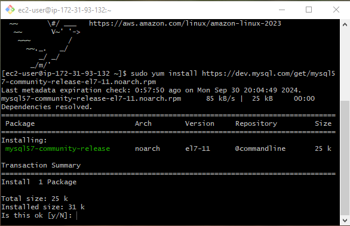

2. Manually import the MySQL GPG key:

    ```bash
    sudo rpm --import https://repo.mysql.com/RPM-GPG-KEY-mysql-2022
    ```

3. Install MySQL:

    ```bash
    sudo yum install mysql-community-server -y
    ```

    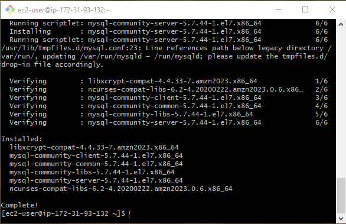

4. Find the root password in:

    ```bash
    sudo cat /var/log/mysqld.log | grep 'temporary password'
    ```

5. Log in with the found password and change the password with the command:

    ```bash
    sudo mysql -u root
    ```

    ```bash
    ALTER USER 'root'@'localhost' IDENTIFIED BY 'NuevaContraseñaSegura';
    ```
    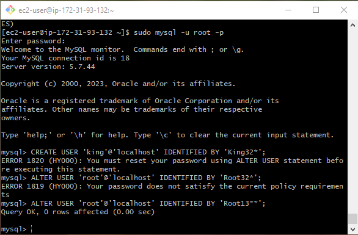

6. Create user and give privileges.

    ```bash
    CREATE USER 'usuario'@'%' IDENTIFIED BY 'tu_contraseña';
    ```

    ```bash
    GRANT ALL PRIVILEGES ON *.* TO 'usuario'@'%' WITH GRANT OPTION;
    ```

    ```bash
    FLUSH PRIVILEGES;
    ```

    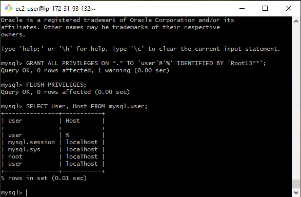

7. Create the data base;

    ```bash
    CREATE DATABASE mydatabase;
    ```

    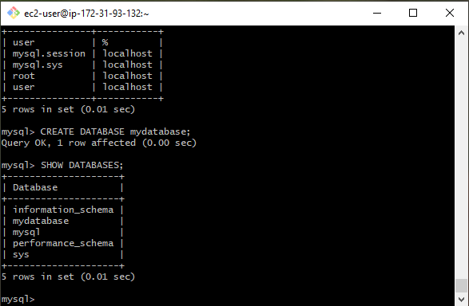


7. Enter the following path and change the file by adding

    ```bash
    sudo nano /usr/bin/etc/my.cnf
    ```

    ```bash
    bin-address = 0.0.0.0
    ```
    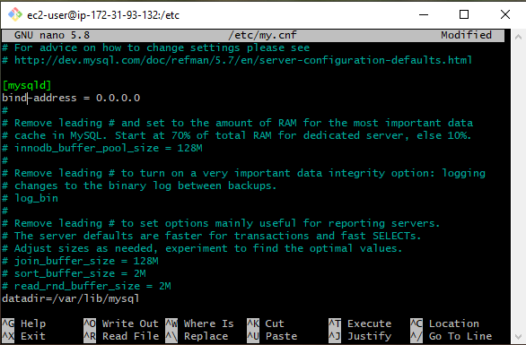 

8. Make the following changes to the code.

    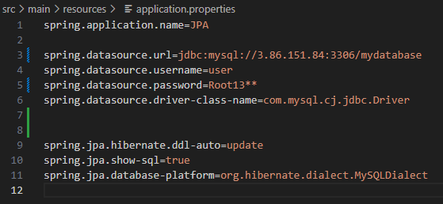

    

9. The project's .jar file is uploaded to the ServerWebDocker virtual machine.

    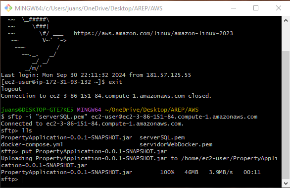

10. Java is installed

    ```bash
    sudo yum install java-17-amazon-corretto -y
    ```

11. Execute the proyect with the command:

    ```bash
    java -jar PropertyApplication-0.0.1-SNAPSHOT.jar
    ```

    And in the following url you can view the project:

    ```bash
    http://98.81.134.203:8080/
    ```
    The url changes every time the instances AWS EC2 is run.

    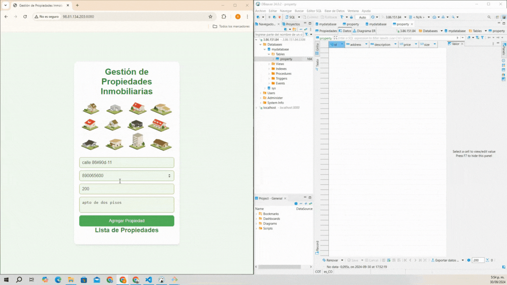


## Diagram Class

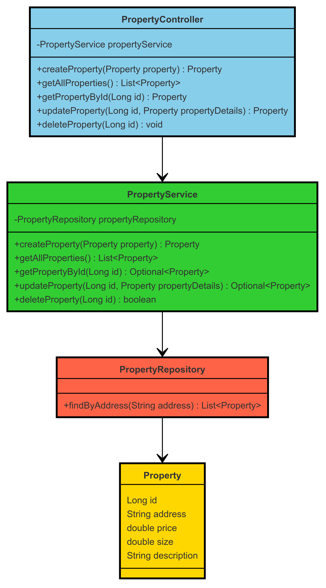


## Class Diagram Explanation

This diagram represents the structure of the Property Management System and shows the relationships between the main classes in the backend.

### Classes:

1. **Property**:
   - Represents the main entity in the system, a "Property" with attributes such as `id`, `address`, `price`, `size`, and `description`.
   - Methods:
     - `getId()`: Returns the ID of the property.
     - `getAddress()`: Returns the address of the property.
     - `getPrice()`: Returns the price of the property.
     - `getSize()`: Returns the size of the property.
     - `getDescription()`: Returns the description of the property.

2. **PropertyController**:
   - Acts as the REST controller that handles HTTP requests for managing properties.
   - Dependencies:
     - Injects `PropertyService` to delegate business logic.
   - Methods:
     - `createProperty(Property property)`: Creates a new property.
     - `getAllProperties()`: Retrieves all properties.
     - `getPropertyById(Long id)`: Retrieves a specific property by ID.
     - `updateProperty(Long id, Property propertyDetails)`: Updates a property by ID.
     - `deleteProperty(Long id)`: Deletes a property by ID.

3. **PropertyService**:
   - Implements the business logic for the system.
   - Dependencies:
     - Injects `PropertyRepository` to interact with the database.
   - Methods:
     - `createProperty(Property property)`: Creates a new property in the database.
     - `getAllProperties()`: Returns a list of all properties from the database.
     - `getPropertyById(Long id)`: Retrieves a property by its ID.
     - `updateProperty(Long id, Property propertyDetails)`: Updates an existing property with new details.
     - `deleteProperty(Long id)`: Deletes a property from the database.

4. **PropertyRepository**:
   - This is the interface responsible for data persistence and extends `JpaRepository`.
   - Methods:
     - `findByAddress(String address)`: Custom method to search for properties by address.


## Architecture

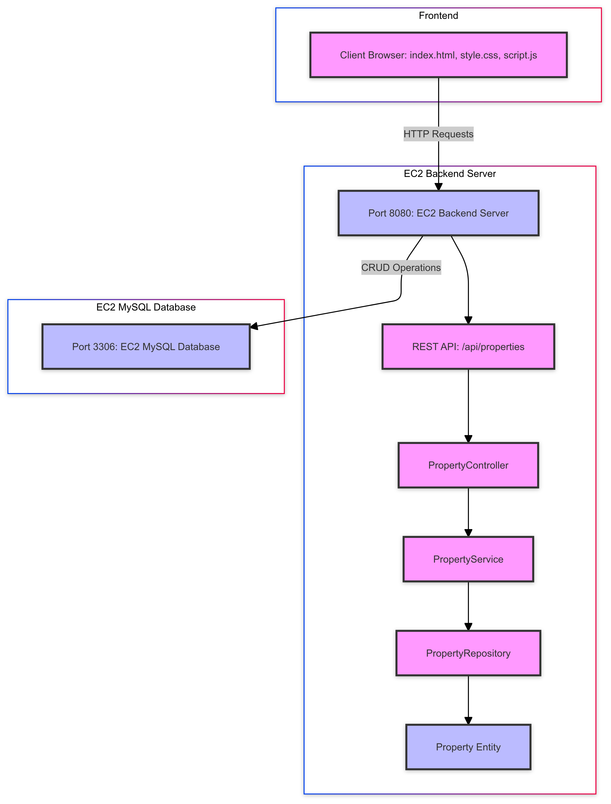

### Diagram Explanation


#### Client Browser:
The browser is the frontend that interacts with the application through static files like `index.html`, `style.css`, and `script.js`. These files send HTTP requests to the backend.

#### ECS Backend Server:
The backend server is deployed on Amazon ECS. It exposes a REST API running on port 8080 and contains the following components:
- **PropertyController**: Handles incoming HTTP requests.
- **PropertyService**: Implements business logic.
- **PropertyRepository**: Manages data persistence operations.
- **Property**: Represents a property entity in the system.

#### ECS MySQL Database:
The MySQL database is deployed on ECS and listens on port 3306. It stores property data.


## Built With

- [Maven](https://maven.apache.org/) - Dependency Management
- [Spring Boot](https://spring.io/projects/spring-boot) - Framework for building microservices
- [Docker](https://www.docker.com/) - Containerization
- [MySQL](https://www.mysql.com/) - Relational Database

## Versioned

We use [Git](https://github.com/) for version control. For available versions, see the tags in this repository.

## Author

* **Jose Ricardo Vasquez Vega** - [Richi025](https://github.com/Richi025)

## Date

October 03, 2024