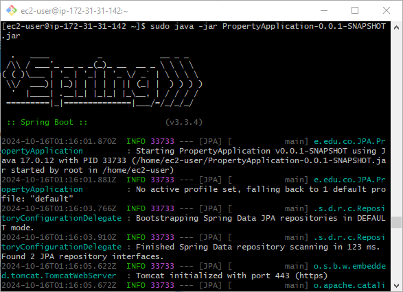

# Property Management System with Spring Boot and MySQL and 

This project is a simple property management system implemented using Spring Boot, JPA (Java Persistence API), and MySQL. The system allows users to register and log in through login and registration interfaces to perform CRUD operations (Create, Read, Update, Delete) on property entities. The properties are stored in a MySQL database, and the application exposes a REST API for interaction. It was deployed on AWS using EC2 instances.

<video controls src="images/Copia de Agregar un título.mp4" title="Title"></video>


https://github.com/user-attachments/assets/6c89177e-43ca-4949-b203-a7e45548fff2


## Getting Started

These instructions will get you a copy of the project up and running on your local machine for development and testing purposes.

### Prerequisites

You need to install the following tools and configure their dependencies:

1. **Java** (version 8 or above)
    
    ```bash
    java -version
    ```

    Should return something like:
    
    ```bash
    java version "1.8.0"
    Java(TM) SE Runtime Environment (build 1.8.0-b132)
    Java HotSpot(TM) 64-Bit Server VM (build 25.0-b70, mixed mode)
    ```

2. **Maven**
    - Download Maven from [here](http://maven.apache.org/download.cgi)
    - Follow the installation instructions [here](https://maven.apache.org/install.html)

    Verify the installation:

    ```bash
    mvn -version
    ```

    Should return something like:

    ```bash
    Apache Maven 3.6.3
    ```

3. **Docker**
    - Install Docker by following the instructions [here](https://docs.docker.com/get-docker/)
    - Verify the installation:
    
    ```bash
    docker --version
    ```

    Should return something like:

    ```bash
    Docker version 20.10.7, build f0df350
    ```

## Installing

1. Clone the repository and navigate into the project directory:
    
    ```bash
    git clone https://github.com/Richi025/Arep-CrudInmobiliario-TLS.git 
    cd PropertyManagement
    ```

2. Build the project:
    
    ```bash
    mvn clean package
    ```

    Should display output similar to:

    ```bash
    [INFO] BUILD SUCCESS
    ```
1. Start the MySQL service using Docker Compose:

    ```bash
    docker-compose up -d
    ```

    This command will start the MySQL container, as defined in the `docker-compose.yml` file.

2. Update your `application.properties` with the following configuration to connect to the MySQL container:

    ```properties
    spring.application.name=JPA
    spring.datasource.url=jdbc:mysql://localhost:3000/mydatabase
    spring.datasource.username=user
    spring.datasource.password=Root13**
    spring.datasource.driver-class-name=com.mysql.cj.jdbc.Driver
    spring.jpa.hibernate.ddl-auto=update
    server.port=8443
    spring.jpa.show-sql=true
    spring.jpa.database-platform=org.hibernate.dialect.MySQLDialect
    server.ssl.key-store-password=password123
    server.ssl.key-store-type=PKCS12
    server.ssl.key-alias=springboot
    server.ssl.key-store=classpath:keystore.p12
    ```
3. Run the application:
    
    ```bash
    java -jar target/PropertyApplication-0.0.1-SNAPSHOT.jar
    ```

4. Access the API at: `https://localhost:8443/login.html`

## Test Resutls

To run the tests use:

  ```bash
  mvn test
  ```


### Explanation:

#### PropertyServiceTest:

- Mocks interactions with `PropertyRepository` and verifies that the service methods are being called and return the expected results.
- All the main methods are tested: create, retrieve, update, and delete.

#### PropertyControllerTest:

- Uses `MockMvc` to simulate HTTP requests to the controller endpoints.
- Verifies the HTTP responses, status codes (such as `200 OK`), and the returned JSON.
- The tested methods include create, retrieve all properties, retrieve by ID, update, and delete.


## Deployment in AWS

To run the program on AWS, we need to have two instances, in my case, they are the following.


In the instance called serverSQL, MySQL and the APACHE web server will be installed, and on the other machine, SPRING BOOT will be deployed. A Let's Encrypt certificate will be generated on each machine to implement the HTTPS protocol.

Two DNS domains are also needed for each EC2 instance in order to generate Let's Encrypt certificates. For this, the following website allows us to generate free domains: https://www.duckdns.org/.


* **ServerSQL** ---> labserverapache.duckdns.org
* **SeverWebDocker** ---> labserverapacheback.duckdns.org

### **instance ServerSQL**

#### A. Install SQL

1. To install SQL on the EC2 instance, you can refer to the README of the following repository.

    ```bash
    https://github.com/Richi025/Arep-CrudInmobiliario.git
    ```

    If you follow the steps in the repository, you will have SQL installed on the instance.

#### B. Install APACHE 

1. Connect to the EC2 instance.

    First, you must connect to the EC2 instance using SSH. Use the following command:

    ```bash
    ssh -i "ruta/a/tu/clave.pem" ec2-user@tu-direccion-ip

    ssh -i "serverSQL.pem" ec2-user@ec2-44-204-45-23.compute-1.amazonaws.com
    ```

2. Update the packages.
    ```bash
    sudo yum update -y
    ```

3. Install Apache.

    ```bash
    sudo yum install httpd -y
    ```

4. Start and enable Apache.

    Once installed, the Apache service must be started and configured to start automatically when the system boots.
    

    ```bash
    sudo systemctl start httpd
    sudo systemctl enable httpd
    ```


5. Check the status of Apache:


    ```bash
    sudo systemctl status httpd
    ```

#### C. Let's Encrypt certificate

1. Install Dependencies:

    To use Certbot, first, install Python and pip (a package manager for Python):

    ```bash
    sudo yum install python3-pip -y
    sudo pip3 install certbot

    ```
    You also need to install the Apache integration package:

     ```bash
    sudo yum install python-certbot-apache

    ```
2.  Configure Apache

    Edit the configuration file for your virtual host for your domain:

    ```bash
    sudo nano /etc/httpd/conf.d/labserverapache.duckdns.org.conf
    ```

    Make sure you have something like the following in your configuration file:

    ```bash
    <VirtualHost *:80>
        ServerName labserverapache.duckdns.org
        DocumentRoot /var/www/html

        RewriteEngine on
        RewriteCond %{SERVER_NAME} =labserverapache.duckdns.org
        RewriteRule ^ https://%{SERVER_NAME}%{REQUEST_URI} [L,R=301]
    </VirtualHost>
    ```


3. Run Certbot

    Once the Apache configuration file is ready, you can run Certbot to obtain the SSL certificate:

    ```bash
    sudo certbot --apache -v -d labserverapache.duckdns.org
    ```

4. Verification

    Now we check the functionality of the certificate by entering the preferred browser and making a query to the DNS labserverapache.duckdns.org using the HTTPS protocol.

    ](images/imageSSL.png)


#### D. Upload frontend files

1. For the frontend to communicate with the backend, the API it will access must be updated.

    

2. Now, proceed to upload all the frontend files to the /var/www/html directory root.

    

### **instance SeverWebDocker**

#### A. Let's Encrypt certificate

1. Connect to the EC2 instance.

    First, you must connect to the EC2 instance using SSH. Use the following command:

    ```bash
    ssh -i "ruta/a/tu/clave.pem" ec2-user@tu-direccion-ip

    ssh -i "servidorWebDocker.pem" ec2-user@ec2-54-227-44-70.compute-1.amazonaws.com
    ```
2. Install Certbot

    You can do so using the following commands:

    ```bash
    sudo yum update -y
    sudo yum install -y certbot python2-certbot-apache

    ```


3. Obtain a Let's Encrypt Certificate

    ```bash
    sudo certbot certonly --standalone -d your_domain.com

    sudo certbot certonly --standalone -d labserverapacheback.duckdns.org

    ```
    

    This command will generate the certificate files, usually located in /etc/letsencrypt/live/your_domain.com/:

    + fullchain.pem: This is the certificate chain.
    + privkey.pem: This is the private key

4. Copy the certificates to a location accessible by Spring Boot

    ```bash
    sudo cp /etc/letsencrypt/live/labserverapacheback.duckdns.org/fullchain.pem /home/ec2-user/

    sudo cp /etc/letsencrypt/live/labserverapacheback.duckdns.org/privkey.pem /home/ec2-user/
    ```

5. Verify access permissions

    ```bash
    sudo chown ec2-user:ec2-user /home/ec2-user/privkey.pem
    sudo chmod 600 /home/ec2-user/privkey.pem

    sudo chown ec2-user:ec2-user /home/ec2-user/fullchain.pem
    sudo chmod 600 /home/ec2-user/fullchain.pem
    ```

6. Configure Spring Boot for HTTPS: Modify the application.properties file:

    ```bash
    server.port=443
    server.ssl.key-store-type=PKCS12
    server.ssl.key-store=/home/ec2-user/keystore.p12
    server.ssl.key-store-password=password123
    server.ssl.key-alias=springboot
    ```

7. Configuration of CORS in Spring Boot

    Communication between servers must be allowed using CORS on the project endpoints as shown in the image.

    

   

    Additionally, CORS can be configured using a WEBCONFIG class, which works globally in the application.

    

8. Convert the certificates to a PKCS12 format: Spring Boot requires a keystore in PKCS12 format.

    ```bash
    sudo yum install openssl -y
    ```

    ```bash
    openssl pkcs12 -export -in /home/ec2-user/fullchain.pem -inkey /home/ec2-user/privkey.pem \ -out /home/ec2-user/keystore.p12 -name "springboot" -password pass:password123
    ```

    ```bash
    sudo chown ec2-user:ec2-user /home/ec2-user/keystore.p12
    sudo chmod 600 /home/ec2-user/keystore.p12
    ```


7. Upload the project's JAR file to the AWS instance and Run the Spring Boot Application.

    ```bash
    sudo java -jar PropertyApplication-0.0.1-SNAPSHOT.jar
    ```

    

8. You can now access the webpage using the following URL, as shown in the video.

    ```bash
    http://labserverapache.duckdns.org/login.html
    ```

    <video controls src="images/Copia de Agregar un título.mp4" title="Title"></video>

    https://github.com/user-attachments/assets/6c89177e-43ca-4949-b203-a7e45548fff2
   
## Diagram Class


## Class Diagram Explanation

This diagram represents the structure of the Property Management System and shows the relationships between the main classes in the backend.

### Classes:

1. **Property (Entity)**

    - Represents a real estate property in the database with attributes such as `id`, `address`, `price`, `size`, and `description`. This class includes getter and setter methods to access and modify these attributes.

2. **User (Entity)**

    - Represents a user in the system, mapped to a database table. Users are utilized for authentication and system management, with attributes like `id`, `username`, and `password` (which is encrypted).

3. **PropertyRepository (Repository)**

    - Provides CRUD operations for `Property` entities using JPA. It includes a custom query method to find properties by address.

4. **UserRepository (Repository)**

    - Manages CRUD operations for `User` entities. It includes a method to find a user by their username.

5. **PropertyService (Service)**

    - Contains the business logic related to property management. It interacts with the repository to create, update, delete, and retrieve properties.

6. **UserService (Service)**

    - Handles the business logic for user management, such as authentication and registration, and interacts with the repository for database operations.

7. **PropertyController (Controller)**

    - Provides API endpoints to manage properties (create, retrieve, update, delete). It communicates with `PropertyService` to execute business logic.

8. **UserController (Controller)**

    - Exposes API endpoints for user operations, such as registration and authentication. It communicates with `UserService` to handle these actions.

## Architecture


### Diagram Explanation

### Explanation of the Diagram

1. **Browser**:
   - The user accesses the application through a browser, which communicates with both the Apache server and the Spring Boot backend. All communication between the browser and the servers is secured using HTTPS on **port 443**, ensuring encrypted data transmission.

2. **EC2 Instance: Apache & MySQL**:
   - This represents an Amazon EC2 instance that hosts both the **Apache server** and **MySQL database**.
   - **Apache Server**: 
     - The Apache server serves the static HTML pages to the browser. These pages are:
       - `login.html`: The login page where users can authenticate.
       - `register.html`: The registration page where new users can sign up.
       - `properties.html`: A page for managing or viewing properties.
   - **MySQL Database**: 
     - The Apache server also communicates with the MySQL database, which is used to store and manage data for the web application. Apache can interact with MySQL to query user or property data.

3. **EC2 Instance: Spring Boot**:
   - This represents another Amazon EC2 instance that runs the **Spring Boot backend**, which handles the core business logic of the application.
   - **Spring Boot Backend**:
     - The Spring Boot backend is responsible for processing requests from the browser and interacting with the database as needed. It includes:
       - `Properties Service`: A service responsible for handling operations related to real estate properties (e.g., creating, updating, and deleting properties).
       - `User Service`: A service that manages user-related operations such as authentication, user registration, and profile management.

4. **HTTPS Connections**:
   - **Browser to Apache (HTTPS)**: The browser securely communicates with the Apache server over HTTPS on **port 443**. The Apache server serves static HTML pages (login, register, properties) to the browser.
   - **Browser to Spring Boot (HTTPS)**: The browser also makes secure HTTPS requests directly to the Spring Boot backend on **port 443** for dynamic operations, such as interacting with the `Properties` and `User` services (e.g., saving new property data, or authenticating users).

5. **Apache to Spring Boot (HTTP)**:
   - While the browser communicates with both servers using HTTPS, the Apache server communicates with the Spring Boot backend over HTTP. This internal communication could be done over HTTP since it is within the secured internal network between the two EC2 instances, although it can also be upgraded to HTTPS for added security.


## Built With

- [Maven](https://maven.apache.org/) - Dependency Management
- [Spring Boot](https://spring.io/projects/spring-boot) - Framework for building microservices
- [Docker](https://www.docker.com/) - Containerization
- [MySQL](https://www.mysql.com/) - Relational Database

## Versioned

We use [Git](https://github.com/) for version control. For available versions, see the tags in this repository.

## Author

* **Jose Ricardo Vasquez Vega** - [Richi025](https://github.com/Richi025)

## Date

October 17, 2024
